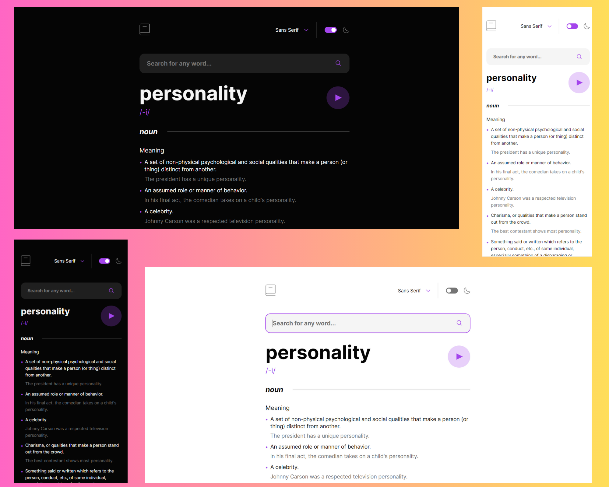

# Dictionary Web App 

Developed a dynamic dictionary website using Vite.js, featuring live word search, pronunciation, audio playback, and detailed definitions with synonyms and antonyms using Dictionary API. Implemented efficient user interface updates for seamless word exploration.

